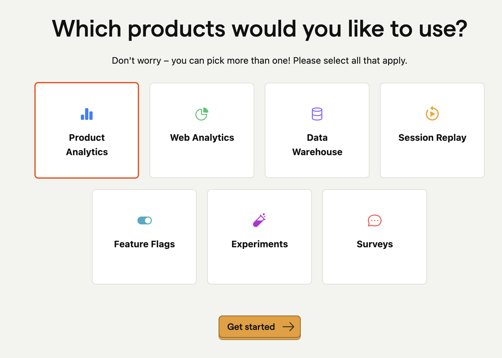
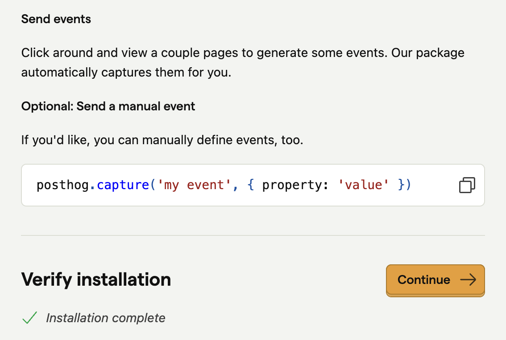
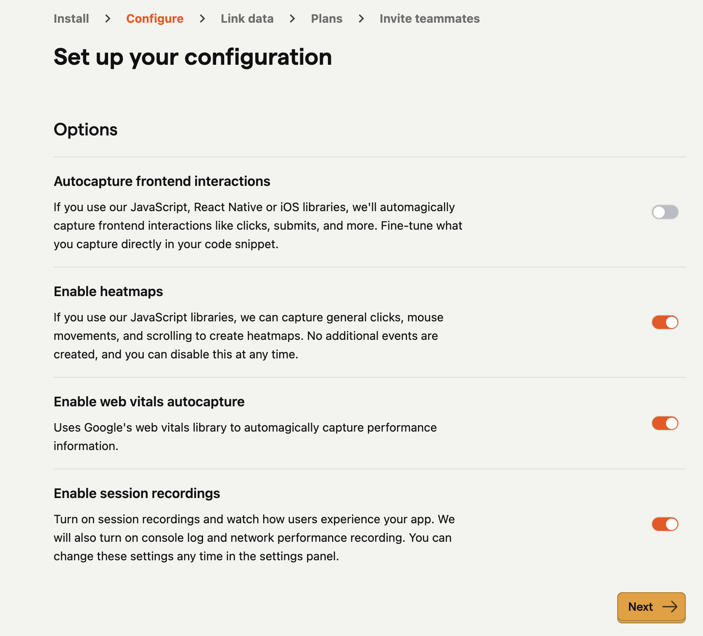

# Posthog Workshop

Velkommen til en workshop i PostHog! 

Etter workshopen vil du ha en bedre forståelse for funksjonaliteten PostHog tilbyr, og hvordan du kan bruke måleverktøy til å lage riktig ting.

<details>
  <summary>Oppsett for kodeprosjektet</summary>

Her er oppsett for kode. Det forutsetter at du allerede har gjort oppgave 1a, hvor du får miljøvariabler.

Legg inn .env-variabler, se .env.local.example. Legg til .env.local.

## Kjør lokalt

Installér avhengigheter:

```bash
pnpm install
```

Kjør prosjektet lokalt:

```bash
pnpm dev
```

Åpne [http://localhost:3000](http://localhost:3000).

</details>

# Oppgaver

Nedover følger oppgaver både i koden og innpå PostHog-prosjektet.

Ulike emojies betyr ulike ting:
- 👉 Oppgaven du skal gjøre, enten i kode eller i PostHog-prosjektet. På noen av oppgavene er det også fasit, som `oppgave1b.fasit.tsx`. Det gjelder ikke alle, ettersom det også er i PostHog-prosjektet.
- 💭 Refleksjonsspørsmål uten fasit. Oppfordrer å reflektere over dette, gjerne med et blikk i foreslått kilde.
- 📖 Litteratur-tips. Ofte en lenke til en nyttig bloggpost eller video. Kan hjelpe deg med oppgaven eller refleksjonsspørsmålet.
- 💡 Løsning i fasit. Poengtert ut hva løsningsforslaget i fasit er.

## Oppgave 1 - Lag ditt første event

I denne oppgaven lærer du hvordan du setter opp Posthog og lager ditt første event. Når du er ferdig, skal du kunne se dine egne eventer i Posthog-dashboardet.

### Oppgave 1a Oppsett


Start med å klone repository.

Gå inn på https://eu.posthog.com/signup, opprett en bruker og en organisasjon, for eksempel "Hobby org".

Så huk av for "Product analysis", og trykk "Get started".



Trykk så inn på guide for "Next.js", om det ikke allerede er standardvalget. Dra secrets inn i `.env.local`.

Vi har allerede initiert prosjektet med en `PostHogProvider.tsx`, se filen. Men du kan gjerne lese gjennom for å forstå hva som foregår.

For å fullføre oppsettet, kan du fyre opp prosjektet:

```
pnpm install && pnpm dev
```

Så trykk deg rundt på siden. Om alt er rett, skal "Verify installation" være sjekket av, og du kan trykke "Continue".



For konfigurasjon av hvilke valg du vil ha med, huk av alt unntatt autocapture. Vi kommer heller til å bruke manuelt event.



Skipp over linked data.

Velg gratis plan.

Avslutt, uten å invitere teammedlemmer 🥲

🎉 Hurra! Du har kommet deg gjennom masse config! I neste oppgave skal vi gjøre noe så gøy som å tracke ditt første event!

💭 Refleksjon: Hvorfor bruke manuelle events istedenfor automatiske?

📖 https://posthog.com/tutorials/event-tracking-guide#autocaptures-limitations

### Oppgave 1b - Ditt første event


👉 Oppgave: Track hvilke FAQ- spørsmål som brukere åpner.
- I koden, legg til manuelt event på FAQ-spørsmål. Se `page.tsx`.
- I PostHog, sjekk fanen "Activity" for om eventet blir registrert.

📖 https://posthog.com/docs/getting-started/send-events

💭 Refleksjon:
- Hvilke events bør du minimum tracke?

📖 https://posthog.com/tutorials/next-steps-after-installing#1-configure-event-capture

💭 Refleksjon:
- Hva må du gjøre annerledes om du vil tracke fra en serverkomponent versus klientkomponent?

📖 https://vercel.com/guides/posthog-nextjs-vercel-feature-flags-analytics#3.-using-posthog-with-react-server-components

<details>
  <summary>Løsning 1b</summary>

Se `oppgave1b.fasit.tsx`.

</details>

## Oppgave 2 - Visualiser innsikt

I denne oppgaven lærer du hvordan du kan visualisere innsikt i PostHog ved å bruke trender og funnels. Dette er viktig for å forstå brukerens atferd og finne forbedringsmuligheter i produktet ditt.

### Oppgave 2a - Trender


👉 Oppgave: Legg til en trend-annotasjon.

💭 Refleksjon:

- Hva er vits med å følge med på trender?
- Hvorfor bruke annotasjoner på trender?

📖 https://www.bekk.christmas/post/2024/07/forsta-produktet-ditt-med-posthog-lag-innsikt-ut-av-malingene

### Oppgave 2b - Funnels


👉 Oppgave: Finn ut hvor brukeren dropper av i skjemaet
- Skjemaet finner du i navbar, ved å trykke på "Funnel"
- I koden, legg inn et event per spørsmål i skjemaet
- I PostHog, legg inn action per steg

<details>
  <summary>Løsning 2b</summary>

Kode: Se `oppgave2b.fasit.tsx`.

Dashboard:


</details>

💭 Refleksjon:
- Om du ser dropp i prosenter per steg, hva er det tegn på - og hva kan du eventuelt gjøre med det?
- Hvordan kan du bruke funnels sammen med retention?

📖 https://www.youtube.com/watch?v=2jQco8hEvTI&t=573s&ab_channel=PostHog

## Lag et dashboard

I denne oppgaven lærer du hvordan du kan samle innsikt i et dashboard i PostHog for å gjøre analyser mer oversiktlige og tilgjengelige.

### Oppgave 3a - Lag et dashboard


👉 Legg inn innsiktene du lagde i oppgave 2 inn på et nytt dashboard

💭 Refleksjon:
- Hva er gode praksiser for å gjøre dashboardet oversiktlig?
- Om dette var et dashboard for ditt oppdrag, hva hadde du ønsket å ha med?

📖 https://www.bekk.christmas/post/2024/08/forsta-produktet-ditt-med-posthog-samle-innsikt-i-produkt-dashboard

## Lag et eksperiment

I denne oppgaven lærer du hvordan du kan sette opp og gjennomføre et eksperiment i PostHog ved hjelp av feature flags og A/B-testing.

Du skal teste om en åpen accordion med en lenke til "funnel" fører til flere besøk enn en lukket accordion.

### Oppgave 4a - Feature flagg

👉 Gå inn på Experiments og opprett nytt eksperiment. Generer samtidig et nytt feature flagg.

💭 Refleksjon:

- Hva har eksperimenter med feature flags å gjøre?
- Hvordan ville du ha lagt til et feature flagg som kun én person kunne se?

📖 https://posthog.com/docs/experiments/creating-an-experiment

📖 https://youtu.be/2jQco8hEvTI?si=0946ThlaQu1FN2m_&t=776

### Oppgave 4b - A/b- test

👉 Ta i bruk flagget i koden, så du kan kontrollere hvem som møter en åpen accordion og ikke.

💭 Refleksjon:

- Hvordan kan du være sikker på at en åpen accordion faktisk genererer flere besøk til /funnel?
- Hvilke eksperimenter kan du gjøre på eget oppdrag?

📖 https://www.bekk.christmas/post/2024/09/forst%C3%A5-produktet-ditt-med-posthog-hypoteser
📖 https://www.youtube.com/watch?v=2jQco8hEvTI&t=847s&ab_channel=PostHog

<details>
  <summary>Løsning 4b</summary>

Kode: Se `oppgave4b.fasit.tsx`.

</details>

## Session replay

I denne oppgaven lærer du hvordan du kan bruke Session Replay i PostHog for å se opptak av brukerøkter og analysere brukeradferd.

### Oppgave 5 - Session replay

👉 Oppgave: Spill av et opptak fra en tidligere sesjon

💭 Refleksjon:
- Hvordan vite hvilke sesjoner som er relevante for deg?
- Hvordan få se en sesjon når en feil oppstår?
- Hvordan kan du filtrere bort sensitiv informasjon fra opptak?

📖 https://posthog.com/tutorials/session-recordings-for-support
📖 https://posthog.com/docs/session-replay/privacy

## Tilbake til oppdrag

Nå har du fullført fem grunnleggende oppgaver for å forstå greia med måling i Posthog 🎉 Hvordan ta dette videre?

### Oppgave 6 - Tilbake til oppdrag

💭 For å ta dette videre, reflektér over følgende:
- Hvordan sørge for at du jevnlig jobber produktnært?
- Hvordan velge oppgavene som gir mest verdi for brukerne?

📖 https://www.bekk.christmas/post/2024/10/forsta-produktet-ditt-med-posthog-fra-innsikt-til-produktbeslutninger

# Ekstra oppgaver

Om du har lyst til å dykke videre i PostHog, her er noen forslag til oppgaver.

## Identifisér brukeren

Legg til et skjema hvor brukeren kan skrive inn epost, og følg deretter brukeren for å identifisere hen. Se https://posthog.com/tutorials/identifying-users-guide og video https://youtu.be/LIJ_TuyMq74?si=fukxQhy67JZSjYPf&t=290

## Track uten behov for cookie-banner

Om du ikke vil lagre brukerens info i cookies, kan du flytte lagringen. Prøv det ut: https://posthog.com/tutorials/cookieless-tracking

## Test med posthog

Lag en test med Jest og Posthog: https://posthog.com/tutorials/test-frontend-feature-flags

# Innspill

Takk for at du deltok i workshopen!

Om du finner feil i oppgave eller tekst, eller bare har forbedringer, bare å ta kontakt med meg eller lag en PR.
