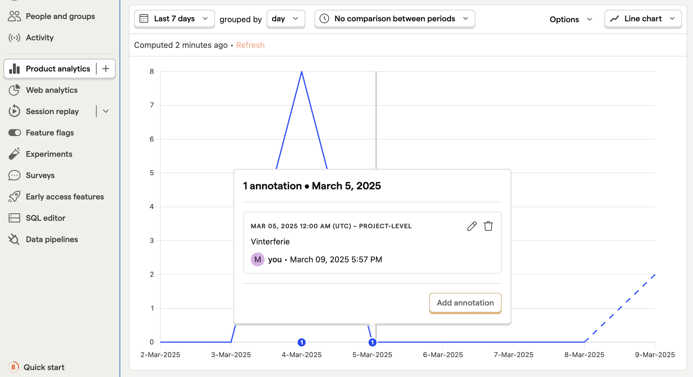
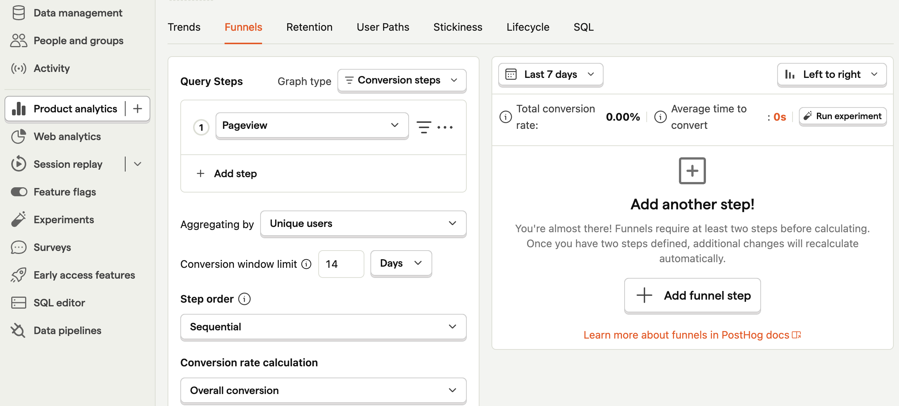
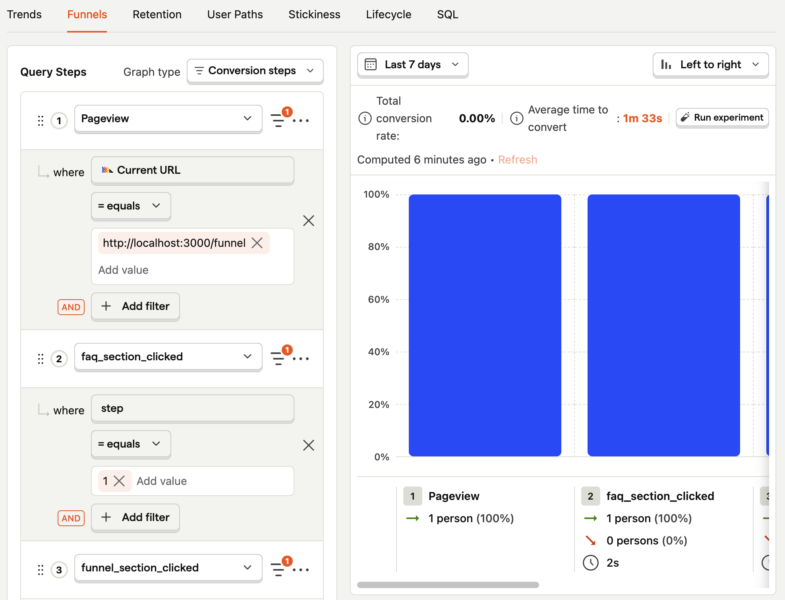
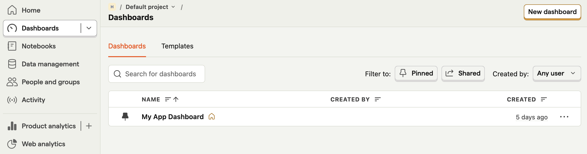

# Posthog Workshop

Workshop for å lære Posthog.

# Oppsett

Legg inn .env-variabler, se .env.local.example. Legg til .env.local. Se oppgave 1a for hvor du finner secrets.

## Kjør lokalt

Installér avhengigheter:

```bash
pnpm install
```

Kjør prosjektet lokalt:

```bash
pnpm dev
```

Åpne [http://localhost:3000](http://localhost:3000).

# Oppgaver

## Oppgave 1 - Lag ditt første event

I denne oppgaven setter vi opp posthog og du lager ditt første event.

### Oppgave 1a Oppsett


Start med å klone repository. Så trenger du å legge inn PostHog- secrets. Da trenger du først en konto.

Gå inn på https://eu.posthog.com/signup og opprett en organisasjon, f.eks. "Hobby org".

Så huk av for "Product analysis", og trykk "Get started".

Trykk så inn på guide for "Nextjs", om det ikke allerede er gjort. Dette første steget med å sette opp provider har vi allerede ordnet for deg, se `PosthogProvider.tsx`. Men du kan gjerne lese gjennom for å forstå hva som foregår.

På denne første siden ser du også secrets for ditt posthog-prosjekt. Om du senere lurer på hvor de er, ta en titt på "Settings".

👉 Oppgave: Før du trykker deg videre på oppsett-siden, gjør følgende: Legg secrets inn på fil `env.local`, kjør opp prosjektet og trykk litt rundt.

Når "Verify installation" er good, kan du trykke videre til "Continue".

👉 Oppgave: Du kan konfigurere ting som om du vil ha på ting som autocapture og heatmaps. La alt unntatt autocapture være på. Vi kommer heller til å bruke manuelt event.

💡 Refleksjon: Hvorfor bruke manuelle events istedenfor automatiske?

📖 https://posthog.com/tutorials/event-tracking-guide#autocaptures-limitations

👉 Oppgave: Bruk gratis plan og hopp over å invitere teammedlemmer.

🎉 Du har nå satt opp Posthog. I Posthog-dashboardet, trykk deg inn på "Web analytics" og se om du har en session replay å titte på.

### Oppgave 1b - Ditt første event


Nå som vi har satt opp Posthog, er det lekende lett å tracke brukerens eventer.

👉 Oppgave: Track hvilke FAQ- spørsmål som brukere åpner. For å se om eventet har blitt sendt, kan du trykke inn på fanen "Activity".

📖 https://posthog.com/docs/getting-started/send-events

💡 Refleksjon:

- Hvilke events bør du minimum tracke?

📖 https://posthog.com/tutorials/next-steps-after-installing#1-configure-event-capture

- Hva må du gjøre annerledes om du vil tracke fra en serverkomponent versus klientkomponent?

📖 https://vercel.com/guides/posthog-nextjs-vercel-feature-flags-analytics#3.-using-posthog-with-react-server-components

## Oppgave 2 - Visualiser innsikt

### Oppgave 2a - Trender



👉 Oppgave: Legg til en trend-annotasjon.

💡 Refleksjon: Hva er vits med å lage trender?

📖 https://www.bekk.christmas/post/2024/07/forsta-produktet-ditt-med-posthog-lag-innsikt-ut-av-malingene

### Oppgave 2b - Funnels



👉 Oppgave: Sett opp en funnel for skjemaet du finner oppe i høyre hjørne på nettsiden.

- I koden, legg inn et event per spørsmål i skjemaet
- I dashboard, legg inn action per steg

<details>
  <summary>Løsning dashboard</summary>



</details>

💡 Refleksjon:

- Om du ser dropp i prosenter per steg, hva er det tegn på - og hva kan du eventuelt gjøre med det?
- Hvordan kan du bruke funnels sammen med retention?

📖 https://www.youtube.com/watch?v=2jQco8hEvTI&t=573s&ab_channel=PostHog

## Lag et dashboard

### Oppgave 3a - Lag et dashboard



👉 Legg inn dashboardene du lagde i oppgave 2 inn på et nytt dashboard

💡 Refleksjon:

- Hva er gode praksiser så dashboardet blir oversiktlig?
- Om dette var et dashboard for ditt oppdrag, hva hadde du ønsket å ha med?

📖 https://www.bekk.christmas/post/2024/08/forsta-produktet-ditt-med-posthog-samle-innsikt-i-produkt-dashboard

## Lag et eksperiment

I FAQ ønsker vi å sjekke om en åpen accordion med lenke til "funnel" fører til flere besøk til "funnel", enn om accordion-en ikke er åpen.

### Oppgave 4a - Feature flagg

👉 Gå inn på Experiments og opprett nytt eksperiment. Generer samtidig nytt feature flagg

💡 Refleksjon:

- Hva har eksperimenter med feature flags å gjøre?
- Hvordan ville du ha lagt til et feature flagg som kun én person kunne se?

📖 Lesestoff:

- https://posthog.com/docs/experiments/creating-an-experiment
- https://youtu.be/2jQco8hEvTI?si=0946ThlaQu1FN2m_&t=776

### Oppgave 4b - A/b- test

👉 Ta i bruk flagget i koden, så du kan kontrollere hvem som møter en åpen accordion og ikke.

💡 Refleksjon:

- Hvordan kan du være sikker på at en åpen accordion faktisk genererer flere besøk til /funnel?
- Hvilke eksperimenter kan du gjøre på eget oppdrag?

📖 https://www.bekk.christmas/post/2024/09/forst%C3%A5-produktet-ditt-med-posthog-hypoteser

### Oppgave 4b - A/b- testing

📖 Lesestoff:

- https://www.youtube.com/watch?v=2jQco8hEvTI&t=847s&ab_channel=PostHog
- https://www.bekk.christmas/post/2024/09/forst%C3%A5-produktet-ditt-med-posthog-hypoteser

## Session replay

### Oppgave 5a - Session replay

👉 Oppgave: Spill av et opptak fra en tidligere sesjon

💡 Refleksjon:

- Hvordan vite hvilke sesjoner som er relevante for deg?
- Hvordan få se en sesjon når en feil oppstår?
- Hvordan kan du filtrere bort sensitiv informasjon fra opptak?

📖 Lesestoff:

- https://posthog.com/tutorials/session-recordings-for-support
- https://posthog.com/docs/session-replay/privacy

## Tilbake til oppdrag

Nå har du fullført fem grunnleggende oppgaver for å forstå greia med måling i Posthog 🎉

💡 For å ta dette videre, reflektér over følgende:

- Hvordan sørge for at du jevnlig jobber produktnært?

- Hvordan velge oppgavene som gir mest verdi for brukerne?

📖 https://www.bekk.christmas/post/2024/10/forsta-produktet-ditt-med-posthog-fra-innsikt-til-produktbeslutninger

# Ekstra oppgaver

Om du har lyst til å dykke videre i PostHog, her er noen forslag til oppgaver.

## Identifisér brukeren

Legg til et skjema hvor brukeren kan skrive inn epost, og følg deretter brukeren for å identifisere hen. Se https://posthog.com/tutorials/identifying-users-guide og video https://youtu.be/LIJ_TuyMq74?si=fukxQhy67JZSjYPf&t=290

## Track uten behov for cookie-banner

Om du ikke vil lagre brukerens info i cookies, kan du flytte lagringen. Prøv det ut: https://posthog.com/tutorials/cookieless-tracking

## Test med posthog

Lag en test med Jest og Posthog: https://posthog.com/tutorials/test-frontend-feature-flags
