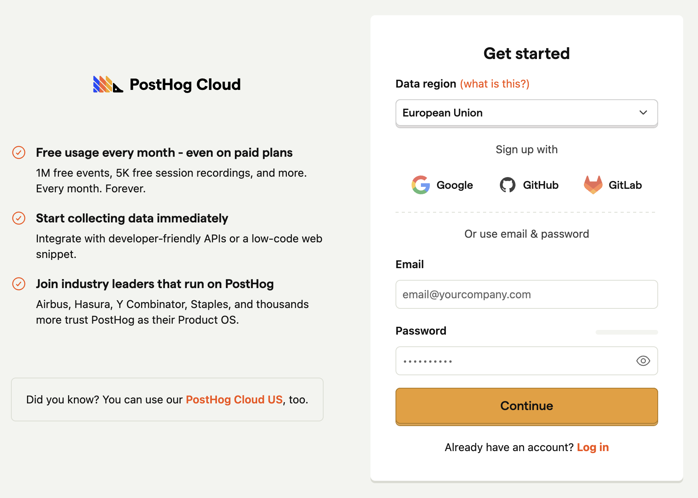
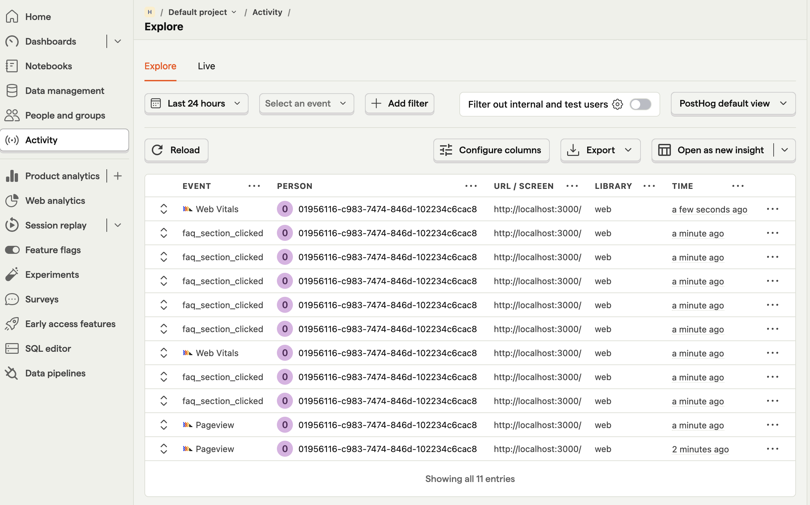

# Posthog Workshop

Workshop for å lære posthog.

# Oppsett

Legg inn .env-variabler, se .env.local.example. Legg til .env.local

## Kjør lokalt

Installér avhengigheter:

```bash
pnpm install
```

Kjør prosjektet lokalt:

```bash
pnpm dev
```

Åpne [http://localhost:3000](http://localhost:3000).

# Oppgaver

## Oppgave 1 - Lag ditt første event

I denne oppgaven setter vi opp posthog og du lager ditt første event.

### Oppgave 1a Oppsett



Start med å klone repository. Så trenger du å legge inn PostHog- secrets. Da trenger du først en konto.

Gå inn på https://eu.posthog.com/signup og opprett en organisasjon, f.eks. "Hobby org".

Så huk av for "Product analysis", og trykk "Get started".

Trykk så inn på guide for "Nextjs", om det ikke allerede er gjort. Dette første steget med å sette opp provider har vi allerede ordnet for deg, se `PosthogProvider.tsx`. Men du kan gjerne lese gjennom for å forstå hva som foregår.

På denne første siden ser du også secrets for ditt posthog-prosjekt. Om du senere lurer på hvor de er, ta en titt på "Settings".

👉 Oppgave: Før du trykker deg videre på oppsett-siden, gjør følgende: Legg secrets inn på fil `env.local`, kjør opp prosjektet og trykk litt rundt.

Når "Verify installation" er good, kan du trykke videre til "Continue".

👉 Oppgave: Du kan konfigurere ting som om du vil ha på ting som autocapture og heatmaps. La alt unntatt autocapture være på. Vi kommer heller til å bruke manuelt event.

💡 Refleksjon: Hvorfor bruke manuelle events istedenfor automatiske?

📖 https://posthog.com/tutorials/event-tracking-guide#autocaptures-limitations

👉 Oppgave: Bruk gratis plan og hopp over å invitere teammedlemmer.

🎉 Du har nå satt opp Posthog. I Posthog-dashboardet, trykk deg inn på "Web analytics" og se om du har en session replay å titte på.

### Oppgave 1b - Ditt første event



Nå som vi har satt opp Posthog, er det lekende lett å tracke brukerens eventer.

👉 Oppgave: Track hvilke FAQ- spørsmål som brukere åpner. For å se om eventet har blitt sendt, kan du trykke inn på fanen "Activity".

📖 https://posthog.com/docs/getting-started/send-events

💡 Refleksjon:

- Hvilke events bør du minimum tracke?

📖 https://posthog.com/tutorials/next-steps-after-installing#1-configure-event-capture

- Hva må du gjøre annerledes om du vil tracke fra en serverkomponent versus klientkomponent?

📖 https://vercel.com/guides/posthog-nextjs-vercel-feature-flags-analytics#3.-using-posthog-with-react-server-components
